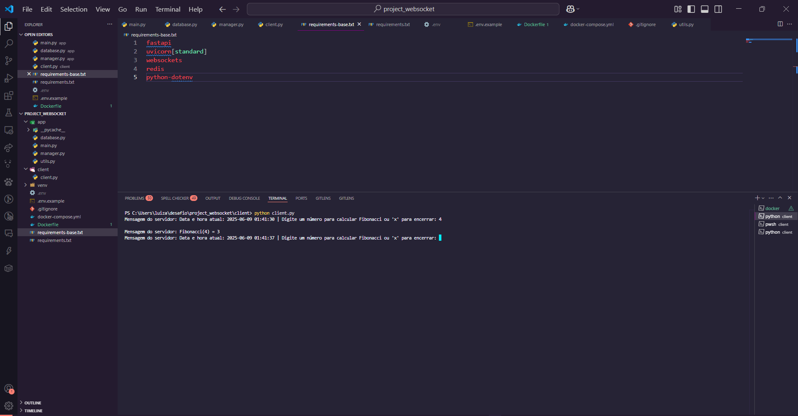
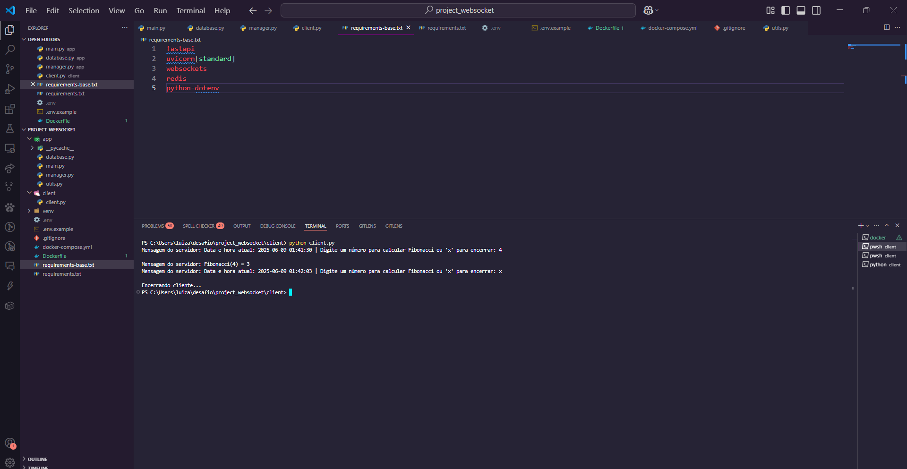
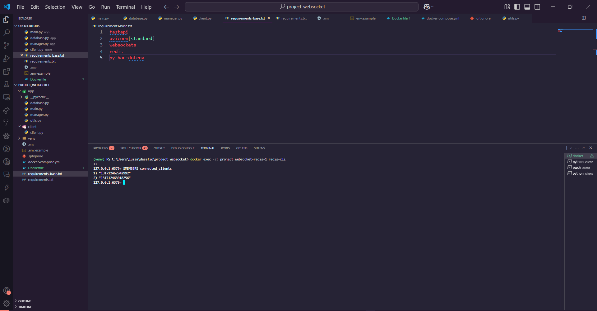
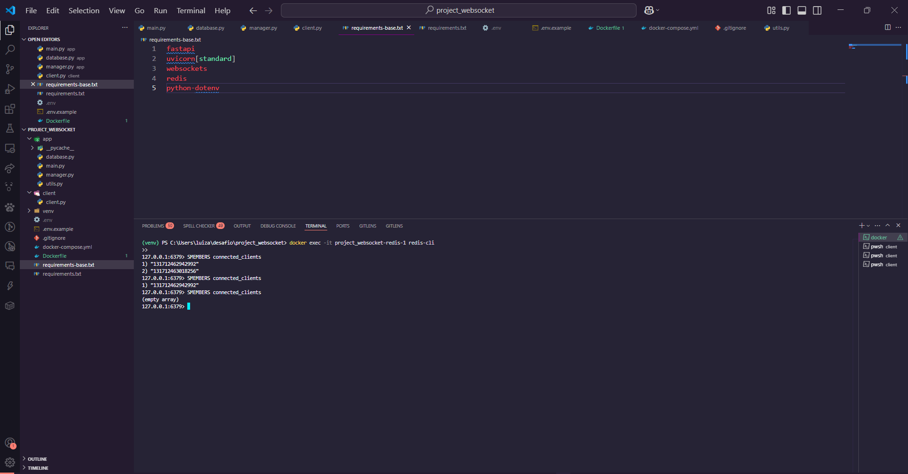

# 📡 Project WebSocket  

Sistema de comunicação **WebSocket** em tempo real, desenvolvido em **Python** com **FastAPI**, que permite conexões simultâneas de clientes, gerenciamento de sessões ativas e execução de comandos sob demanda. A aplicação utiliza **Redis** para armazenar e monitorar as conexões dos clientes, possibilitando consultar as conexões ativas e processar dados em tempo real.

---

## 📦 Tecnologias Utilizadas  

- 
- 
- 
- 
- 

---

## 🚀 Como Rodar a Aplicação  

A aplicação usa **Docker Compose** para facilitar o setup e execução do ambiente.

### 📥 Clone o repositório  

```bash
git clone https://github.com/yohana-teixeira01/project_websocket.git
cd project_websocket
```
### 🐍 Crie um ambiente virtual

```bash
python -m venv venv
```
### 🔥 Ative o ambiente virtual
Windows:
```bash
venv\Scripts\activate
```
Linux/Mac:
```bash
source venv/bin/activate
```
### 📦 Instale as dependências
```bash
pip install -r requirements.txt
```
Se necessário, atualize o pip:
```bash
python -m pip install --upgrade pip
```
Depois:
```bash
pip install -r requirements-base.txt
```
### ⚙️ Configuração de Ambiente
Crie um arquivo .env na raiz do projeto com o conteúdo do .env.example.

### 🐳 Subir containers com Docker
```bash
docker-compose up --build -d
```
### 🔎 Consultar clientes conectados via Redis
Acesse o terminal do container Redis:
```bash
docker exec -it project_websocket-redis-1 redis-cli
```
Dentro do Redis CLI:
```bash
SMEMBERS connected_clients
```
Isso irá listar os IDs dos clientes conectados ou retornar vazio se não houver conexões.

### 💻 Rodar o Cliente WebSocket
Em outro terminal:
```bash
cd client
python client.py
```
### ✅ Observações
Não é necessário rodar *uvicorn app.main:app --reload* — o projeto funciona com Docker e o cliente via *client.py*.

As variáveis de ambiente devem ser configuradas no arquivo *.env*, conforme exemplo.

Para Linux/MacOS, ajustar os comandos de ativação do ambiente virtual.

### 🖼️ Imagens da Aplicação

Aqui estão algumas capturas de tela e imagens que mostram o funcionamento do sistema WebSocket em tempo real:

<p align="center">
  
  <br>
  <i>Aplicação rodando no terminal com clientes conectados</i>
</p>

<p align="center">
  
  <br>
  <i>Aplicação rodando no terminal com clientes se desconectando</i>
</p>

<p align="center">
  
  <br>
  <i>Visualização dos clientes conectados no Redis </i>
</p>

<p align="center">
  
  <br>
  <i>Visualização dos clientes desconectados no Redis</i>
</p>

